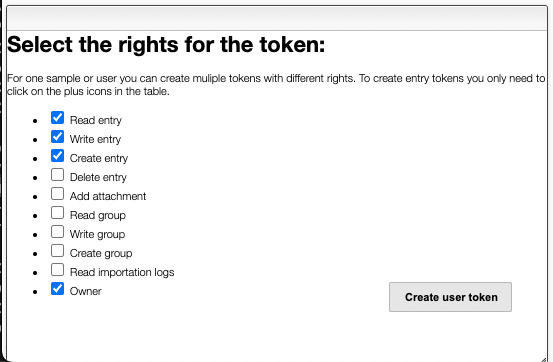

# stock-printer-proxy

- Server to launch print commands
- Monitors printers on printers configured in rest-on-couch database
- Sends printer status to rest-on-couch printer database
- Authentication to rest-on-couch uses an [access token](https://github.com/cheminfo/rest-on-couch/blob/main/API.md#tokens)

The user should have the rights read, write, create and owner.



## Env variables

Those env variables must be defined:

- REST_ON_COUCH_URL
- REST_ON_COUCH_DATABASE
- REST_ON_COUCH_ACCESS_TOKEN
- SERVER_PORT
- PRINTER_PROTOCOL - can be http or tcp, default is `http`
- DISABLE_MONITOR - Do not update registered printers' status in the database, default is `false`
- HOST - Server host, e.g. `printers.my-domain.com`, default is `127.0.0.1:<PORT>` - Only needed if you want to expose the swagger documentation of the service.
- BASE_PATH - Base path for the server, default is `/` - Only needed if you want to expose the swagger documentation of the service.

# Development

## Run in development

Run a dev server which restarts automatically on code changes:

```bash
npm run dev
```

The dev server has monitoring disabled so it won't be doing DB operations.
The docs can be accessed on http://127.0.0.1:7770/documentation

## Publish a new version

To publish a new version, create a github release with a new tag `vX.Y.Z` and the package will be automatically published to github's docker registry.

Use the "Generate changelog" feature to autofill the description of the release.
